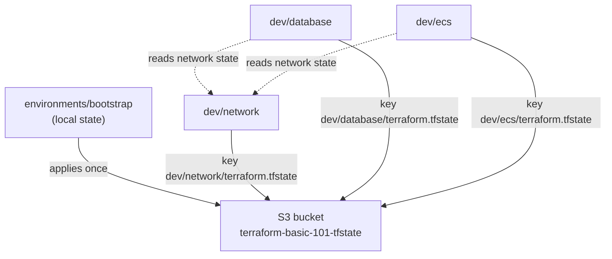
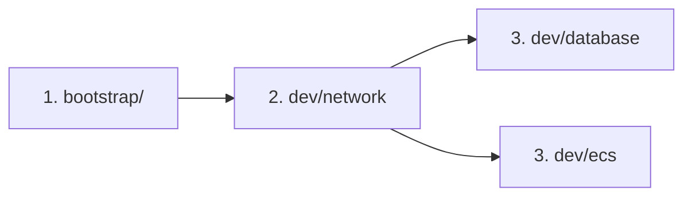

# Repository Architecture

> **Scope of this document.** This describes the **Terraform codebase
> architecture**: how the repository is laid out, how state is organised,
> and how workspaces run. It deliberately does **not** dive into the AWS
> resources themselves (VPC, RDS, ECS) — for those, follow the comments in
> each `main.tf` and the links to the registry modules.
>
> If a term in here is new to you, read `docs/CONCEPTS.md` first — it
> explains every concept in plain language.

This repository is the **simplified sibling** of `terraform-101`
(<https://github.com/offloadmemory/terraform-101>), which demonstrates the
same standards with a multi-account, multi-environment layout. Here there
is **one account, one environment (`dev`), four workspaces, and no custom
modules** — the minimum that still shows a real, end-to-end Terraform
workflow.

---

## 1. Design principles

The layout follows the **enterprise folder structure standard** (HashiCorp
style guide / Gruntwork reference — the same standard `terraform-101`
benchmarks against). Everything below is a consequence of five rules:

1. **One workspace = one folder = one state file.** Each component
   (`network`, `database`, `ecs`) is an independent Terraform configuration
   with its own state. No shared state, no cross-contamination.
2. **Thin roots.** A workspace is a *composition*: provider + registry
   module call + variables + outputs. No infrastructure logic lives in the
   repo.
3. **Registry modules only.** All resources come from the Terraform
   Registry with pinned versions. There is no `modules/` directory — that is
   the deliberate simplification vs. `terraform-101`.
4. **Environments are folders, not `terraform workspace`.** If you add
   `staging`/`prod` later, you copy `dev` and change the backend + tfvars.
5. **State is remote, locked, and private.** One S3 bucket, per-workspace
   keys, S3-native locking, encryption, and public access blocked.

---

## 2. Repository layout

```
terraform-basic-101/
├── README.md
├── Makefile                        # fmt / validate / plan / apply / destroy
├── scripts/
│   ├── validate-all.sh             # fmt + init -backend=false + validate (offline)
│   ├── plan-all.sh                 # real init + plan on every workspace
│   ├── apply-all.sh                # apply in dependency order
│   └── destroy-all.sh              # destroy in reverse order
├── docs/                           # CONCEPTS, ARCHITECTURE, SETUP, DEMO-SCRIPT, TROUBLESHOOTING
├── .github/workflows/ci.yml        # PR CI: fmt + validate + tflint
├── .pre-commit-config.yaml         # same gates, locally on every commit
├── .terraform-docs.yml             # kept for parity with the standard (no local modules to document)
├── .tflint.hcl                     # tflint config (AWS ruleset)
│
└── environments/                   # ══ WORKSPACES — one folder = one state ══
    ├── bootstrap/                  #   ⚠ local state — creates the state bucket
    └── dev/                        #   ── the (only) environment ──
        ├── network/                #     VPC, subnets, NAT   → state key dev/network
        ├── database/               #     RDS PostgreSQL      → state key dev/database
        └── ecs/                    #     ECS + ALB           → state key dev/ecs
```

There are **1 + 3 = 4 workspaces**. Each can be planned, applied, and
destroyed independently, in a defined order.

---

## 3. The workspace anatomy (what every folder contains)

Every `environments/*/{bootstrap|network|database|ecs}` folder is a complete
Terraform configuration. The file names follow the HashiCorp style guide:

| File | Role |
|---|---|
| `main.tf` | The module calls + any `data` sources |
| `providers.tf` | The `provider "aws"` block (region + profile from vars) |
| `variables.tf` | Every input, each with `description` + `type` |
| `terraform.tfvars` | The actual values for this workspace |
| `outputs.tf` | What this workspace returns to humans / other workspaces |
| `terraform.tf` | `required_version` + `required_providers` (version pins) |
| `backend.tf` | **network/database/ecs only** — the S3 state pointer |
| `.terraform.lock.hcl` | Committed provider lock (reproducible installs) |

`bootstrap` is the exception: it has **no `backend.tf`** because its job is
to create the bucket that every other backend points to.

---

## 4. State management

### The state flow



### Conventions

- **Bucket:** `terraform-basic-101-tfstate` (globally unique — change in
  `bootstrap/terraform.tfvars` **and** the `backend.tf` files if taken).
- **Keys:** `<workspace>/terraform.tfstate`, one per workspace.
- **Locking:** S3-native (`use_lockfile = true`, Terraform ≥ 1.11). A
  second concurrent run fails with `412` / "state lock" — see
  `docs/TROUBLESHOOTING.md`.
- **Security:** versioning on (roll-back a bad state write), AES256
  encryption, TLS-only bucket policy, public access blocked, `force_destroy
  = false` (the bucket cannot be deleted while it holds state).

### The bootstrap chicken-and-egg

`bootstrap` runs with **local** state because the bucket doesn't exist yet.
Nothing else can `init` until bootstrap has applied. This is the single most
important "aha" of the repo — see `docs/CONCEPTS.md` section 10.

---

## 5. Cross-workspace coupling

`database` and `ecs` need values the `network` workspace produces (subnet
IDs, VPC ID). They read them at run time from the network's **state file**:

```hcl
data "terraform_remote_state" "network" {
  backend = "s3"
  config = {
    bucket  = "terraform-basic-101-tfstate"
    key     = "dev/network/terraform.tfstate"
    region  = "us-east-1"
    profile = "dev"
  }
}
```

This is the simplest way to share values between workspaces — and it is
deliberately *brittle*:

- the `key` is a hardcoded string — if the network state ever moves, the
  data source breaks silently;
- the ordering is implicit — `database`/`ecs` fail at plan/apply time if
  `network` hasn't been applied yet;
- nothing declares the dependency; it is convention.

`terraform-101` shows the enterprise cure (Terragrunt `dependency` blocks,
SSM output publication). For a first demo, the simplicity is worth the
fragility — just respect the apply order.

---

## 6. Execution model

### Dependency order



1. **bootstrap** — once, local state.
2. **per environment:** `network` → `database` → `ecs`, manual sequential
   runs (or `make apply`).

### Tooling

| Command | What it does | Credentials? |
|---|---|---|
| `make fmt` | `terraform fmt --recursive` | no |
| `make validate` | fmt + `init -backend=false` + `validate` on all 4 workspaces | no (offline) |
| `make plan` | real `init` + `plan` on all 4 | yes (profile `dev` must exist) |
| `make apply` | `init` + `apply -auto-approve` in dependency order | yes |
| `make destroy` | `init` + `destroy` in reverse order (bootstrap excluded unless `--include-bootstrap`) | yes |

`validate` uses `init -backend=false`, so it never touches S3 — it works
before bootstrap, with no credentials, and is what CI runs.

---

## 7. Environment management (the promotion story)

Today there is one environment, `dev`. Adding more is a mechanical copy:

1. `cp -r dev staging`
2. Change `backend.tf` (bucket/key) and `terraform.tfvars` (profile, CIDRs,
   instance sizes).
3. Optionally: create a second state bucket for `staging` in bootstrap.
4. Nothing in `main.tf` / `variables.tf` / `outputs.tf` changes.

This "copy the folder, change the values" story is exactly what
`terraform-101` demonstrates with real dev/staging/prod accounts — and what
Terragrunt automates away at scale.

---

## 8. Cheat-sheet

```bash
# offline verification, no credentials
make fmt && make validate

# one-time state bootstrap
cd environments/bootstrap && terraform init && terraform apply

# live demo — dev only, in order
cd environments/dev/network  && terraform init && terraform apply
cd environments/dev/database && terraform init && terraform apply
cd environments/dev/ecs      && terraform init && terraform apply

# open the app
cd environments/dev/ecs && terraform output alb_dns_name

# teardown (reverse order)
make destroy
```
