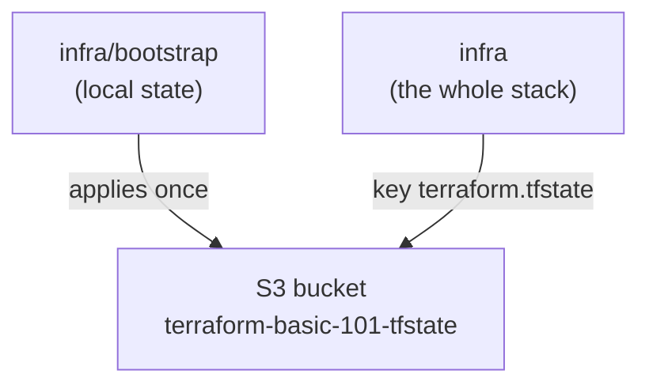
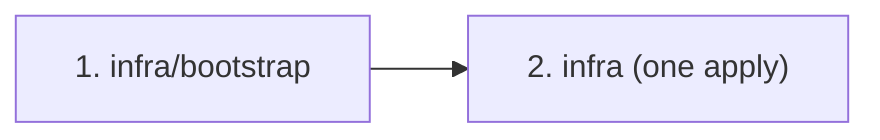

# Repository Architecture

> **Scope of this document.** This describes the **Terraform codebase
> architecture**: how the repository is laid out, how state is organised,
> and how the configurations run. It deliberately does **not** dive into the
> AWS resources themselves (VPC, RDS, ECS) — for those, follow the comments
> in `network.tf` / `database.tf` / `ecs.tf` and the links to the registry
> modules.
>
> If a term in here is new to you, read `docs/CONCEPTS.md` first — it
> explains every concept in plain language.

This repository is the **simplified sibling** of `terraform-101`
(<https://github.com/offloadmemory/terraform-101>), which demonstrates the
same standards with a multi-account, multi-environment layout. Here there
is **one account, one environment, one configuration (`infra/`), and no
custom modules** — the minimum that still shows a real, end-to-end Terraform
workflow.

---

## 1. Design principles

The layout follows the **enterprise folder structure standard** (HashiCorp
style guide / Gruntwork reference — the same standard `terraform-101`
benchmarks against). Everything below is a consequence of five rules:

1. **One configuration = one folder = one state file.** The whole stack
   (`network`, `database`, `ecs`) is a *single* Terraform configuration in
   one folder, sharing one state file. No shared state between teams, no
   cross-contamination.
2. **Split by concern, not by state.** Within that one configuration the
   resources are organised as `network.tf`, `database.tf`, `ecs.tf` — file
   per concern, but a single `terraform init` and a single apply that orders
   everything itself.
3. **Thin root.** The configuration is a *composition*: provider + registry
   module calls + variables + outputs. No infrastructure logic lives in the
   repo.
4. **Registry modules only.** All resources come from the Terraform
   Registry with pinned versions. There is no `modules/` directory — that is
   the deliberate simplification vs. `terraform-101`.
5. **Environments are folders, not `terraform workspace`.** If you add
   `staging`/`prod` later, you copy the `infra/` folder and change the
   backend + tfvars (see section 7).
6. **State is remote, locked, and private.** One S3 bucket, one state key,
   S3-native locking, encryption, and public access blocked. The single
   exception is the bootstrap config, which must keep local state (section 4).

---

## 2. Repository layout

```
terraform-basic-101/
├── README.md
├── Makefile                        # fmt / validate / plan / apply / destroy
├── scripts/
│   ├── validate.sh                 # fmt + init -backend=false + validate (offline)
│   ├── plan.sh                     # real init + plan on both configurations
│   ├── apply.sh                    # apply bootstrap → infra (dependency order)
│   └── destroy.sh                  # destroy infra → bootstrap (reverse order)
├── docs/                           # CONCEPTS, ARCHITECTURE, SETUP, DEMO-SCRIPT, TROUBLESHOOTING
├── .github/workflows/ci.yml        # PR CI: fmt + validate + tflint
├── .pre-commit-config.yaml         # same gates, locally on every commit
├── .terraform-docs.yml             # kept for parity with the standard (no local modules to document)
├── .tflint.hcl                     # tflint config (AWS ruleset)
│
└── infra/                          # ══ THE TERRAFORM CODE ══
    ├── bootstrap/                  #   ⚠ the state-bucket bootstrap (LOCAL state)
    ├── backend.tf                  # S3 remote state + locking (whole stack)
    ├── providers.tf                # provider "aws" (region + profile from vars)
    ├── terraform.tf                # required_version + required_providers (version pins)
    ├── variables.tf                # every input, each with description + type
    ├── terraform.tfvars            # the actual values
    ├── outputs.tf                  # what the stack returns to humans
    ├── network.tf                  #   VPC, subnets, NAT gateway
    ├── database.tf                 #   RDS PostgreSQL + its security group
    └── ecs.tf                      #   ECS cluster + ALB + Fargate service
```

There are **2 Terraform roots**: `infra/bootstrap/` and `infra/`. `infra/`
is the *only* environment; `bootstrap` exists purely to create the state
bucket that `infra` depends on.

---

## 3. The configuration anatomy (what every root contains)

`infra/` is a complete Terraform configuration. The file names follow the
HashiCorp style guide:

| File | Role |
|---|---|
| `network.tf` | The VPC module call |
| `database.tf` | The RDS module call + its security-group module |
| `ecs.tf` | The cluster + ALB + service module calls |
| `providers.tf` | The `provider "aws"` block (region + profile from vars) |
| `variables.tf` | Every input, each with `description` + `type` |
| `terraform.tfvars` | The actual values for the stack |
| `outputs.tf` | What the stack returns to humans |
| `terraform.tf` | `required_version` + `required_providers` (version pins) |
| `backend.tf` | The S3 state pointer (remote state + locking) |
| `.terraform.lock.hcl` | Committed provider lock (reproducible installs) |

`infra/bootstrap/` is the exception: it has **no `backend.tf`** because its
job is to create the bucket that the other root's backend points to.

---

## 4. State management

### The state flow



Two state files total:

- `infra/bootstrap` → **local** state on the machine that runs it.
- `infra` → **remote** state in the S3 bucket, key `terraform.tfstate`.

Because everything the environment needs (VPC, subnets, RDS, ECS) lives in
that one `infra` state file, `database.tf` and `ecs.tf` reference the VPC
directly (`module.vpc.*`) — **there is no `terraform_remote_state` anywhere
in this repo**. Sharing between modules inside one configuration needs no
data source; Terraform resolves the dependency graph itself.

### Conventions

- **Bucket:** `terraform-basic-101-tfstate` (globally unique — change in
  `bootstrap/terraform.tfvars` **and** `infra/backend.tf` if taken).
- **Key:** `terraform.tfstate` — one for the whole stack.
- **Locking:** S3-native (`use_lockfile = true`, Terraform ≥ 1.11). A
  second concurrent run fails with `412` / "state lock" — see
  `docs/TROUBLESHOOTING.md`.
- **Security:** versioning on (roll-back a bad state write), AES256
  encryption, TLS-only bucket policy, public access blocked, `force_destroy
  = false` (the bucket cannot be deleted while it holds state).

### The bootstrap chicken-and-egg

`infra/bootstrap` runs with **local** state because the bucket doesn't exist
yet. Nothing else can `init` until bootstrap has applied. This is the single
most important "aha" of the repo — see `docs/CONCEPTS.md` section 10.

---

## 5. Cross-resource coupling (direct references, not state reads)

The `database` and `ecs` modules need values the `vpc` module produces
(subnet IDs, VPC ID). In a multi-workspace layout those live in a *different
state file*, so you'd have to read them with `data "terraform_remote_state"`.

**This repo doesn't do that.** Because network, database, and ECS all live in
one configuration with one state file, they reference each other directly:

```hcl
# database.tf — the DB sits in the VPC's private subnets, and its security
# group is attached to the VPC.
module "db" {
  ...
  subnet_ids             = module.vpc.private_subnets
  vpc_security_group_ids = [module.db_sg.id]   # db_sg uses module.vpc.vpc_id
}

# ecs.tf — the ALB sits in the VPC's public subnets.
module "alb" {
  ...
  vpc_id  = module.vpc.vpc_id
  subnets = module.vpc.public_subnets
}
```

This is the *simplest and strongest* way Terraform shares values: no
hardcoded state keys, no `terraform_remote_state`, no brittle ordering — the
graph does it. It is the **exact opposite** of the enterprise
multi-workspace cure `terraform-101` demonstrates (Terragrunt `dependency`
blocks, SSM output publication). For a first demo, direct references are
worth the layout simplicity.

---

## 6. Execution model

### Dependency order



1. **bootstrap** — once, local state, creates the bucket.
2. **infra** — one apply. Terraform orders VPC → database/ECS internally.

### Tooling

| Command | What it does | Credentials? |
|---|---|---|
| `make fmt` | `terraform fmt --recursive` | no |
| `make validate` | fmt + `init -backend=false` + `validate` on both roots | no (offline) |
| `make plan` | real `init` + `plan` on both roots | yes (profile `dev` must exist) |
| `make apply` | `init` + `apply -auto-approve` on bootstrap then infra | yes |
| `make destroy` | `init` + `destroy` on infra then bootstrap (bootstrap excluded unless `--include-bootstrap`) | yes |

`validate` uses `init -backend=false`, so it never touches S3 — it works
before bootstrap, with no credentials, and is what CI runs.

---

## 7. Environment management (the promotion story)

Today there is one environment — it *is* `infra/`. Adding more is a
mechanical copy:

1. `cp -r infra staging-infra`
2. Change `backend.tf` (bucket/key) and `terraform.tfvars` (profile, CIDRs,
   instance sizes).
3. Optionally: create a second state bucket for `staging` in bootstrap.
4. Nothing in `network.tf` / `database.tf` / `ecs.tf` / `variables.tf` /
   `outputs.tf` changes.

This "copy the folder, change the values" story is exactly what
`terraform-101` demonstrates with real dev/staging/prod accounts — and what
Terragrunt automates away at scale.

---

## 8. Cheat-sheet

```bash
# offline verification, no credentials
make fmt && make validate

# one-time state bootstrap
cd infra/bootstrap && terraform init && terraform apply

# deploy the whole stack (one action)
cd infra && terraform init && terraform apply

# open the app
cd infra && terraform output alb_dns_name

# teardown (reverse order — bootstrap excluded by default)
make destroy
```
